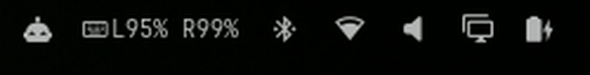

# ZMK split battery

Battery level of both halves of a ZMK split keyboard, in the Omarchy bar.

<p align="center">
  
</p>

Operating systems show a single battery for a Bluetooth keyboard, so the
second half of a split is invisible. ZMK can publish the other half's level
through the central, and this widget reads both and shows them side by side.
It hides itself while no ZMK keyboard is connected. Click it to refresh.

## Requirements

- Omarchy 4 or later (the shell plugin system).
- A ZMK keyboard paired over Bluetooth. The keyboard is found automatically,
  so no address or name needs to be configured.
- For two values, the **central half** of the split must be built with both
  options below. Both default to `n` in ZMK.

  ```
  CONFIG_ZMK_SPLIT_BLE_CENTRAL_BATTERY_LEVEL_FETCHING=y
  CONFIG_ZMK_SPLIT_BLE_CENTRAL_BATTERY_LEVEL_PROXY=y
  ```

  See [Peripheral Battery Monitoring](https://zmk.dev/docs/config/battery#peripheral-battery-monitoring)
  and the [split configuration table](https://zmk.dev/docs/config/split) in
  the ZMK docs. Without them the widget still works but shows one unlabeled
  value, the central's own battery. The same happens for a non-split ZMK board.

## Install

```bash
omarchy plugin add https://github.com/djunho/omarchy-zmk-split-battery --enable
```

The widget lands in the right section of the bar. Move it if you like:

```bash
omarchy bar move io.github.djunho.zmk-split-battery --section center
```

## Use

The widget shows one percentage per half, `L` for the left and `R` for the
right, and hides itself while no ZMK keyboard is connected. It refreshes
every 5 minutes. Click it to refresh now.

## Configure

ZMK reports the central half first, and only you know which physical side
that is. Stock Corne firmware runs the central on the left, which is the
default. If your central is the right half:

```bash
omarchy bar set io.github.djunho.zmk-split-battery centralSide right
```

| Setting       | Values          | Default | Meaning                                    |
|---------------|-----------------|---------|--------------------------------------------|
| `centralSide` | `left`, `right` | `left`  | Physical side that pairs with the computer |

## How it works

Everything is read from BlueZ over D-Bus with `busctl` and `jq`, both of
which ship with Omarchy. No pairing, scanning or extra daemons.

1. Every connected device is checked for the ZMK vendor and product ID,
   `1D50:615E`, which ZMK writes into its Bluetooth Device Information Service
   and BlueZ exposes as the device `Modalias`. The pair is
   [documented by ZMK](https://zmk.dev/docs/config/system) and
   [registered to ZMK Firmware](https://github.com/openmoko/openmoko-usb-oui)
   in OpenMoko's free USB ID block.
2. Every Battery Level characteristic (Bluetooth SIG UUID `0x2A19`) on that
   device is read. The central's own level comes first, the proxied peripheral
   second.
3. The widget polls every 5 minutes and on click.

## Reading looks stale?

ZMK samples the battery only while a half is active, and stops 30 seconds
after the last keypress on that half (the `CONFIG_ZMK_IDLE_TIMEOUT` default).
A half left charging untouched keeps reporting its pre-charge level until you
type on it. Press a key on that half and refresh.

## Remove

```bash
omarchy plugin remove io.github.djunho.zmk-split-battery
```

This deletes the plugin folder and drops the widget from the bar. Nothing
else on the system is touched.

## License

GPL-3.0, see [LICENSE](LICENSE).
